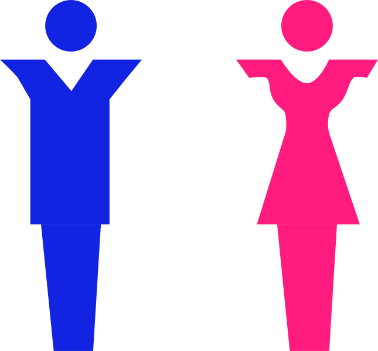

# 🎨 SVG Morphing — by mniCodingAxis
This repository contains all the source code and examples from the SVG Morphing Series on [YouTube Channel](https://www.youtube.com/@mniCodingAxis)
It explores how to transform one SVG shape into another mathematically and visually, using pure HTML, CSS, and JavaScript — no external libraries required!

# 🧩 What is SVG Morphing?

**SVG Morphing** is the process of smoothly transforming one shape into another by interpolating between their path coordinates.
This project breaks it down step-by-step — from design in Adobe XD to pure code implementation in JavaScript.

# 🧠 Core Concepts

- Sampling points along SVG paths using getTotalLength() and getPointAtLength()

- Interpolating points between two paths using a time parameter t

- Building new path strings dynamically using interpolated coordinates

- Animating transitions frame-by-frame for smooth morphs

- Applying easing functions for natural and expressive motion

# 🛠️ Tech Stack

- HTML5

- CSS3

- Vanilla JavaScript

- SVG

No frameworks. No libraries.
✨ Just pure logic, motion, and creativity.

🚀 Getting Started

1. Clone the repository:
```bash
git clone https://github.com/mni007nomi/SVG-Morphing.git
cd SVG-Morphing
```

2. Open the desired HTML file in your browser.
3. Experiment with paths, timing, and easing for different morphing effects!


